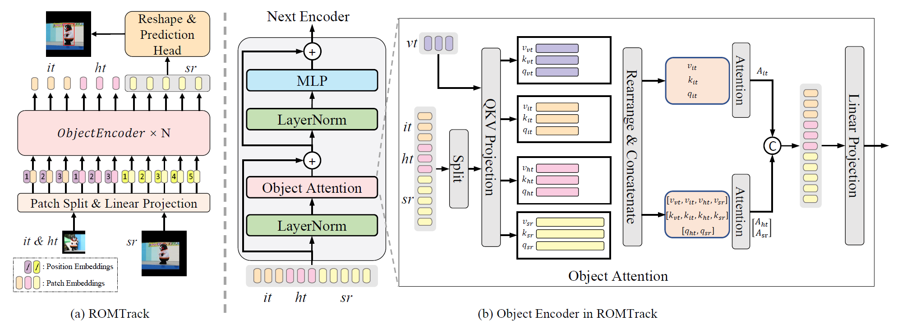
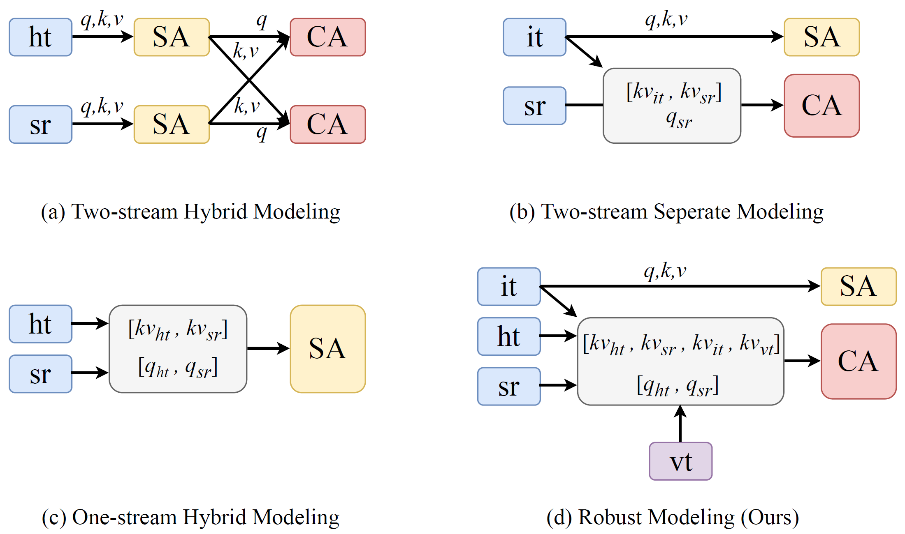
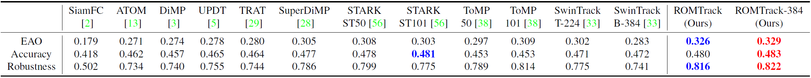
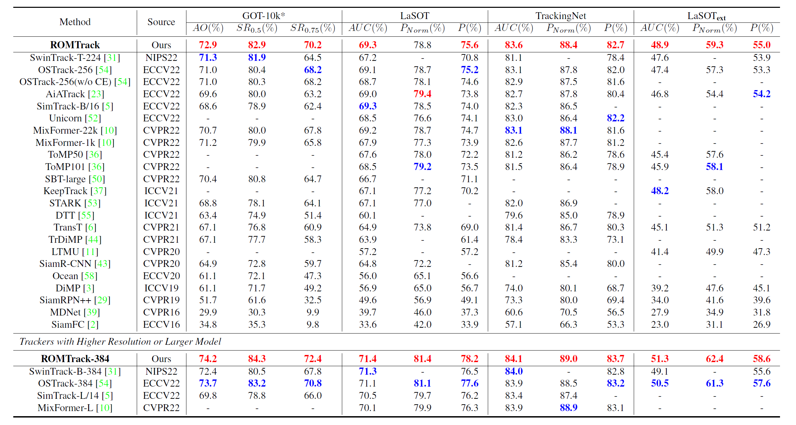
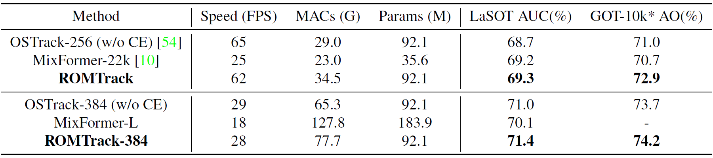
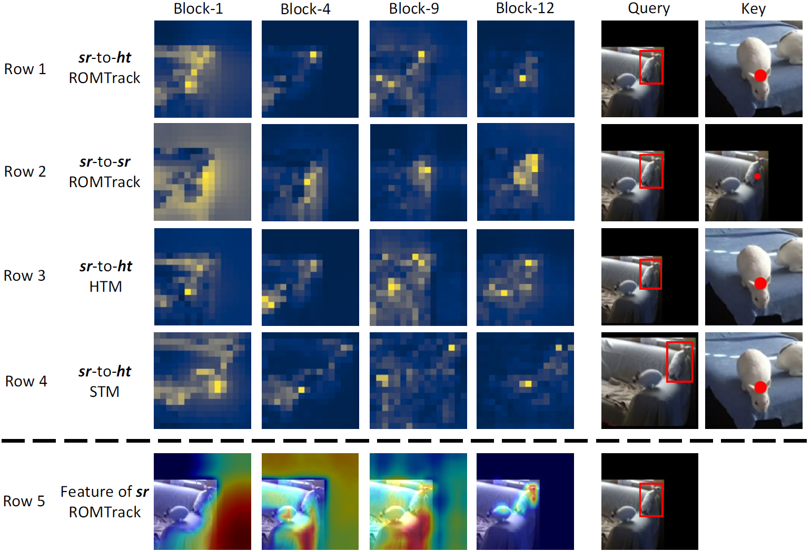

# ROMTrack
The official implementation of the ICCV 2023 paper [*Robust Object Modeling for Visual Tracking*](https://arxiv.org/abs/2308.05140)

[[CVF Open Access]](https://openaccess.thecvf.com/content/ICCV2023/papers/Cai_Robust_Object_Modeling_for_Visual_Tracking_ICCV_2023_paper.pdf
) [[Poster]](asset/Poster.pdf) [[Video]](https://www.bilibili.com/video/BV1p84y1d7ja/)

<p align="center">

</p>

[[Models and Raw Results]](https://drive.google.com/drive/folders/1Q7CpNIhWX05VU7gECnhePu3dKzTV_VoK?usp=drive_link) (Google Drive) [[Models and Raw Results]](https://pan.baidu.com/s/1JsOh_YKPmVAdJwn_XcUg5g) (Baidu Netdisk: romt)

## :newspaper: News
**[October 18, 2023]**
- We update paper in CVF Open Access version.
- We release poster and video.

**[September 21, 2023]**
- We release Models and Raw Results of ROMTrack.
- We refine README for more details.

**[August 6, 2023]**
- We release Code of ROMTrack.

**[July 14, 2023]**
- ROMTrack is accepted to **ICCV2023**.

## :calendar: TODO
- [x] Code for ROMTrack
- [x] Model Zoo and Raw Results
- [x] Refine README

## :star: Highlights
### :rocket: New Tracking Framework pursing Robustness
- ROMTrack employes a robust object modeling design which can keep the inherent information of the target template and enables mutual feature matching between the target and the search region simultaneously.

<p align="center">

</p>

- **Robustness Comparison** with SOTA methods (bounding box only) on VOT2020.
  <p align="center">
  
  </p>

### :rocket: Strong Performance and Comparable Speed
- Performance on Benchmarks
  <p align="center">
  
  </p>
- Speed, MACs, Params (Test on 1080Ti)
  <p align="center">
  
  </p>

## :book: Install the environment
Use the Anaconda
```
conda create -n romtrack python=3.6
conda activate romtrack
bash install_pytorch17.sh
```

## :book: Data Preparation
Put the tracking datasets in ./data. It should look like:
   ```
   ${ROMTrack_ROOT}
    -- data
        -- lasot
            |-- airplane
            |-- basketball
            |-- bear
            ...
        -- lasot_ext
            |-- atv
            |-- badminton
            |-- cosplay
            ...
        -- got10k
            |-- test
            |-- train
            |-- val
        -- coco
            |-- annotations
            |-- train2017
        -- trackingnet
            |-- TRAIN_0
            |-- TRAIN_1
            ...
            |-- TRAIN_11
            |-- TEST
   ```
## :book: Set project paths
Run the following command to set paths for this project
```
python tracking/create_default_local_file.py --workspace_dir . --data_dir ./data --save_dir .
```
After running this command, you can also modify paths by editing these two files
```
lib/train/admin/local.py  # paths about training
lib/test/evaluation/local.py  # paths about testing
```

## :book: Train ROMTrack
Training with multiple GPUs using DDP. More details of other training settings can be found at ```tracking/train_romtrack.sh```
```
bash tracking/train_romtrack.sh
```

## :book: Test and evaluate ROMTrack on benchmarks

- LaSOT/LaSOT_ext/GOT10k-test/TrackingNet/OTB100/UAV123/NFS30. More details of test settings can be found at ```tracking/test_romtrack.sh```
```
bash tracking/test_romtrack.sh
```

## :book: Compute FLOPs/Params and test speed
```
python tracking/profile_model.py --config="baseline_stage1"
```

## :book: Visualization
We provide attention maps and feature maps for several sequences on LaSOT. Detailed analysis can be found in our paper.
<p align="center">

</p>

## :bookmark: Acknowledgments
* Thanks for [STARK](https://github.com/researchmm/Stark), [PyTracking](https://github.com/visionml/pytracking) and [MixFormer](https://github.com/MCG-NJU/MixFormer) Library, which helps us to quickly implement our ideas and test our performances.
* Our implementation of the ViT is modified from the [Timm](https://github.com/rwightman/pytorch-image-models) repo.

## :pencil: Citation
If our work is useful for your research, please feel free to star:star2: and cite our paper:
```
@InProceedings{Cai_2023_ICCV,
    author    = {Cai, Yidong and Liu, Jie and Tang, Jie and Wu, Gangshan},
    title     = {Robust Object Modeling for Visual Tracking},
    booktitle = {Proceedings of the IEEE/CVF International Conference on Computer Vision (ICCV)},
    month     = {October},
    year      = {2023},
    pages     = {9589-9600}
}

@article{DBLP:journals/corr/abs-2308-05140,
  author       = {Yidong Cai and
                  Jie Liu and
                  Jie Tang and
                  Gangshan Wu},
  title        = {Robust Object Modeling for Visual Tracking},
  journal      = {CoRR},
  volume       = {abs/2308.05140},
  year         = {2023}
}
```