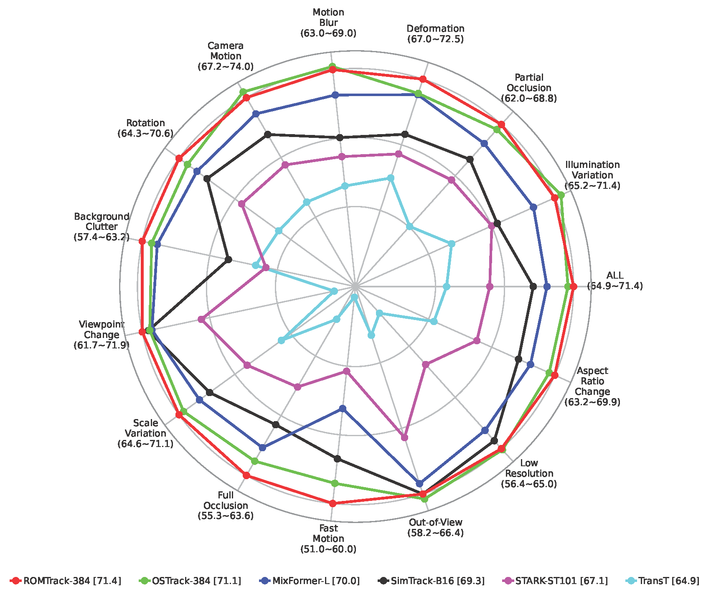
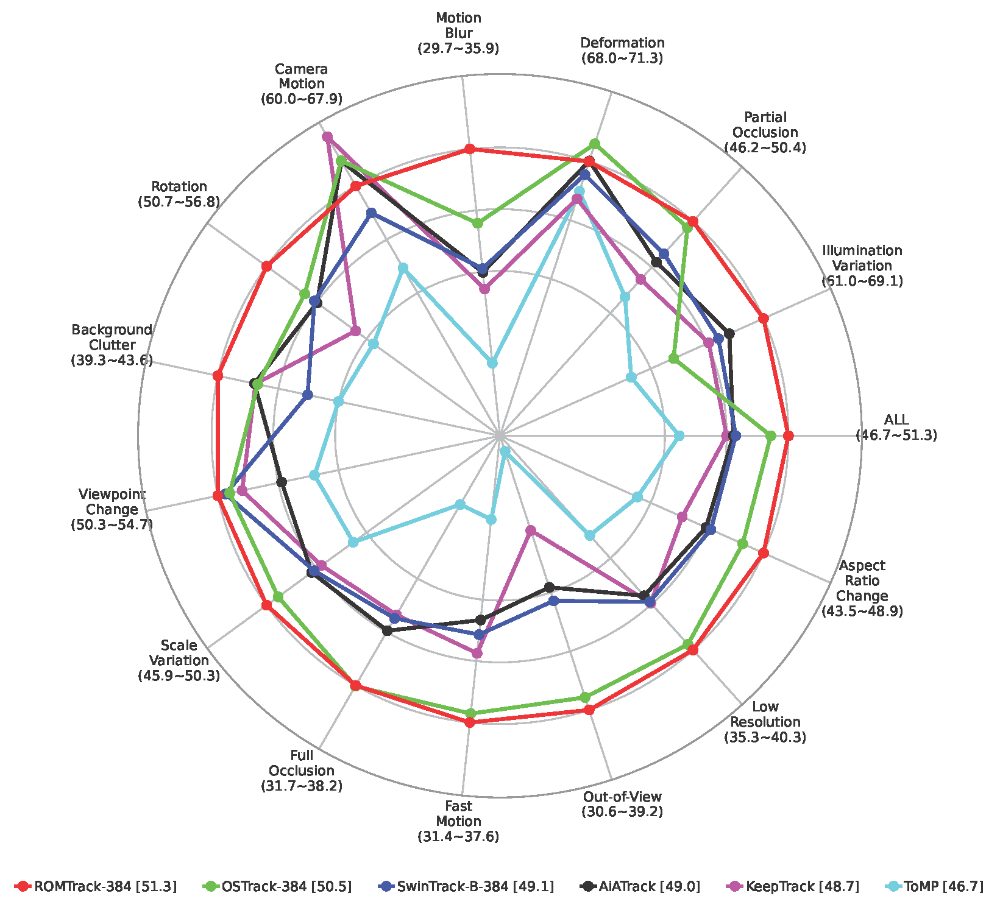

# ROMTrack
The official implementation of the ICCV 2023 paper [*Robust Object Modeling for Visual Tracking*](https://arxiv.org/abs/2308.05140)

[[CVF Open Access]](https://openaccess.thecvf.com/content/ICCV2023/papers/Cai_Robust_Object_Modeling_for_Visual_Tracking_ICCV_2023_paper.pdf
) [[Poster]](asset/Poster.pdf) [[Video]](https://www.bilibili.com/video/BV1p84y1d7ja/)

<p align="center">

</p>

[[Models and Raw Results]](https://drive.google.com/drive/folders/1Q7CpNIhWX05VU7gECnhePu3dKzTV_VoK?usp=drive_link) (Google Drive) [[Models and Raw Results]](https://pan.baidu.com/s/1JsOh_YKPmVAdJwn_XcUg5g) (Baidu Netdisk: romt)

#### Base Models 

|                Variant               |           ROMTrack           |         ROMTrack-384         |
| :----------------------------------: | :--------------------------: | :--------------------------: |
|             Model Setting            |           ViT-Base           |           ViT-Base           |
|           Pretrained Method          |             MAE              |             MAE              |
|           Pretrained Weight          |[MAE checkpoint](https://dl.fbaipublicfiles.com/mae/pretrain/mae_pretrain_vit_base.pth)|[MAE checkpoint](https://dl.fbaipublicfiles.com/mae/pretrain/mae_pretrain_vit_base.pth)|
|           Template / Search          |      128×128 / 256×256       |      192×192 / 384×384       |
| GOT-10k <br> (AO / SR 0.5 / SR 0.75) |      72.9 / 82.9 / 70.2      |      74.2 / 84.3 / 72.4      |
|    LaSOT <br> (AUC / Norm P / P)     |      69.3 / 78.8 / 75.6      |      71.4 / 81.4 / 78.2      |
| TrackingNet <br> (AUC / Norm P / P)  |      83.6 / 88.4 / 82.7      |      84.1 / 89.0 / 83.7      |
|  LaSOT_ext <br> (AUC / Norm P / P)   |      48.9 / 59.3 / 55.0      |      51.3 / 62.4 / 58.6      |
|    TNL2K <br> (AUC / Norm P / P)     |      56.9 / 73.7 / 58.1      |      58.0 / 75.0 / 59.6      |
|      NFS / OTB / UAV <br> (AUC)      |      68.0 / 71.4 / 69.7      |      68.8 / 70.9 / 70.5      |
|     GPU FPS / MACs(G) / Params(M)    |       116 / 34.5 / 92.1      |        67 / 77.7 / 92.1      |
|                CPU FPS               |              9.9             |              3.0             |

#### Extended Models 

|                Variant               |       ROMTrack-Tiny-256      |      ROMTrack-Small-256      |
| :----------------------------------: | :--------------------------: | :--------------------------: |
|             Model Setting            |           ViT-Tiny           |           ViT-Small          |
|           Pretrained Method          |  Supervised on ImageNet-22k  |  Supervised on ImageNet-22k  |
|           Pretrained Weight          |[Timm checkpoint](https://storage.googleapis.com/vit_models/augreg/Ti_16-i21k-300ep-lr_0.001-aug_none-wd_0.03-do_0.0-sd_0.0--imagenet2012-steps_20k-lr_0.03-res_384.npz)|[Timm checkpoint](https://storage.googleapis.com/vit_models/augreg/S_32-i21k-300ep-lr_0.001-aug_light1-wd_0.03-do_0.0-sd_0.0--imagenet2012-steps_20k-lr_0.03-res_384.npz)|
|           Template / Search          |      128×128 / 256×256       |      128×128 / 256×256       |
|    LaSOT <br> (AUC / Norm P / P)     |      59.3 / 68.8 / 60.4      |      62.3 / 72.3 / 65.3      |
| TrackingNet <br> (AUC / Norm P / P)  |      75.8 / 81.7 / 71.5      |      78.5 / 84.3 / 75.3      |
|  LaSOT_ext <br> (AUC / Norm P / P)   |      40.4 / 49.7 / 43.1      |      43.2 / 52.9 / 47.1      |
|    TNL2K <br> (AUC / Norm P / P)     |      48.6 / 64.4 / 45.5      |      52.0 / 68.7 / 50.5      |
|      NFS / OTB / UAV <br> (AUC)      |      62.5 / 68.5 / 62.9      |      65.3 / 68.9 / 66.4      |
|     GPU FPS / MACs(G) / Params(M)    |       466 /  2.7 / 8.0       |       236 /  9.3 / 25.4      |
|                CPU FPS               |             36.6             |             17.2             |

## :newspaper: News
**[April 18, 2024]**

- We release the extended models ***<u>ROMTrack-Tiny-256</u>*** and ***<u>ROMTrack-Small-256</u>*** for Efficient Visual Tracking!
- We provide detailed information for all versions of ROMTrack, see **Base Models** and **Extended Models** above.

**[April 17, 2024]**
- Repository Upgrade is already done! Training and Evaluation using PyTorch 2.2.0 and Python 3.8 brings more efficiency.
- Training and Evaluation Devices for the upgraded code: RTX A6000, Intel(R) Xeon(R) Silver 4314 CPU @ 2.40GHz, Ubuntu 20.04.1 LTS.

**[March 25, 2024]**
- We upgrade the implementation to Python 3.8 and PyTorch 2.2.0!
- We update results on TNL2K!
- We update FPS metrics on RTX A6000 GPU for reference.

**[March 21, 2024]**
- We update 2 radar plots for visualization on LaSOT and LaSOT_ext.
- We post a blog on [Zhihu](https://zhuanlan.zhihu.com/p/662351482), welcome for reading.

**[October 18, 2023]**
- We update paper in CVF Open Access version.
- We release poster and video.

**[September 21, 2023]**
- We release Models and Raw Results of ROMTrack.
- We refine README for more details.

**[August 6, 2023]**
- We release Code of ROMTrack.

**[July 14, 2023]**
- ROMTrack is accepted to **ICCV2023**!

## :calendar: TODO
- [x] Extended Models for ROMTrack
- [x] Repository Upgrade
- [x] More Analysis(Radar Plot) and More Results(TNL2K Dataset)
- [x] Code for ROMTrack
- [x] Model Zoo and Raw Results
- [x] Refine README

## :star: Highlights
### :rocket: New Tracking Framework pursing Robustness
- ROMTrack employes a robust object modeling design which can keep the inherent information of the target template and enables mutual feature matching between the target and the search region simultaneously.

<p align="center">

</p>

- **Robustness Comparison** with SOTA methods (bounding box only) on VOT2020.
  <p align="center">
  
  </p>

### :rocket: Strong Performance and Comparable Speed
- Performance on Benchmarks
  <p align="center">
  
  </p>
- Radar Analysis on LaSOT and LaSOT_ext
  <p align="center">
  
  
  </p>
- Speed, MACs, Params (Test on 1080Ti)
  <p align="center">
  
  </p>

## :book: Install the environment
Use the Anaconda
```
conda create -n romtrack python=3.8
conda activate romtrack
bash install_pytorch.sh
```

## :book: Data Preparation
Put the tracking datasets in ./data. It should look like:
   ```
   ${ROMTrack_ROOT}
    -- data
        -- lasot
            |-- airplane
            |-- basketball
            |-- bear
            ...
        -- lasot_ext
            |-- atv
            |-- badminton
            |-- cosplay
            ...
        -- got10k
            |-- test
            |-- train
            |-- val
        -- coco
            |-- annotations
            |-- train2017
        -- trackingnet
            |-- TRAIN_0
            |-- TRAIN_1
            ...
            |-- TRAIN_11
            |-- TEST
   ```
## :book: Set project paths
Run the following command to set paths for this project
```
python tracking/create_default_local_file.py --workspace_dir . --data_dir ./data --save_dir .
```
After running this command, you can also modify paths by editing these two files
```
lib/train/admin/local.py  # paths about training
lib/test/evaluation/local.py  # paths about testing
```

## :book: Train ROMTrack
Training with multiple GPUs using DDP. More details of other training settings can be found at ```tracking/train_romtrack.sh```
```
bash tracking/train_romtrack.sh
```

## :book: Test and evaluate ROMTrack on benchmarks

- LaSOT/LaSOT_ext/GOT10k-test/TrackingNet/OTB100/UAV123/NFS30. More details of test settings can be found at ```tracking/test_romtrack.sh```
```
bash tracking/test_romtrack.sh
```

## :book: Compute FLOPs/Params and test speed
```
python tracking/profile_model.py --config="baseline_stage1"
```

## :book: Visualization
We provide attention maps and feature maps for several sequences on LaSOT. Detailed analysis can be found in our paper.
<p align="center">

</p>

## :bookmark: Acknowledgments
* Thanks for [STARK](https://github.com/researchmm/Stark), [PyTracking](https://github.com/visionml/pytracking) and [MixFormer](https://github.com/MCG-NJU/MixFormer) Library, which helps us to quickly implement our ideas and test our performances.
* Our implementation of the ViT is modified from the [Timm](https://github.com/rwightman/pytorch-image-models) repo.

## :pencil: Citation
If our work is useful for your research, please feel free to star :star: and cite our paper:
```
@InProceedings{Cai_2023_ICCV,
    author    = {Cai, Yidong and Liu, Jie and Tang, Jie and Wu, Gangshan},
    title     = {Robust Object Modeling for Visual Tracking},
    booktitle = {Proceedings of the IEEE/CVF International Conference on Computer Vision (ICCV)},
    month     = {October},
    year      = {2023},
    pages     = {9589-9600}
}
```